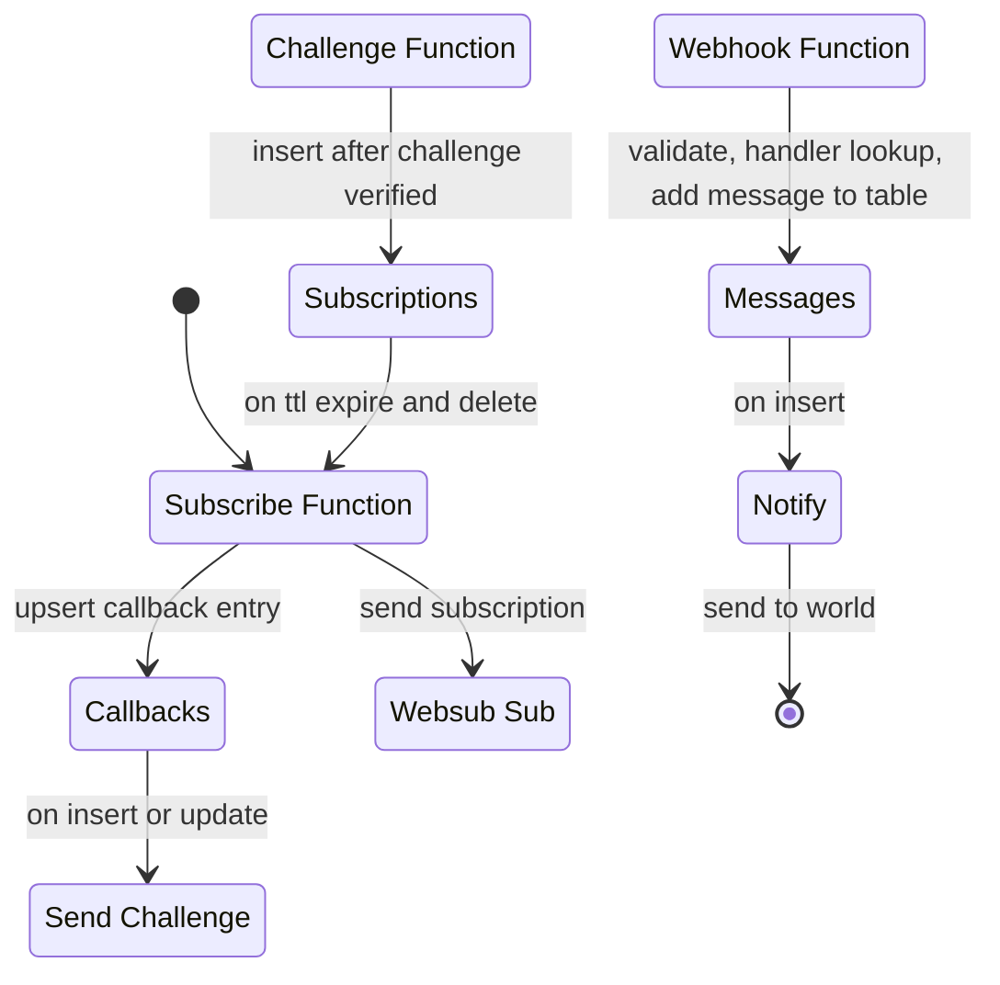

# Websub

collection of lambda functions to eventually potentially act as a websub hub

## Plan

- [x] cli add-subscription -> dynamodb insert subscriptions
- [x] on subscriptions insert/update -> subscribe -> send subscribe request
- [x] api_gateway get -> challenge-verify -> dynamodb insert lease | resp 200
- [x] on lease expire -> renew -> dynamodb insert subscription
- [x] cli add-consumer -> add-consumer -> dynamodb insert consumers
- [x] cli create-handler -> create-handler -> dynamodb insert handler
- [?] api_gateway post -> webhook -> find handlers -> for each dynamodb insert message
- [x] on message insert -> notify -> find consumer -> send message

## Todos

- write stats function?

## Schema

### table: subscriptions
    hub_url: String,
    topic_url: String,
    handler: String,
    callback_index: uuid,
    expiry: usize

### table: subscription_leases
    index: uuid
    handler: string
    expiry: usize

### table: subscription_handlers
    subscription_id: uuid
    handler: string

### table: messages
    index: string
    body: string
    handler: string
    expiry: usize




## Functions

### subscribe
iam: dynamodb:
    subscriptions
    callbacks

```json
{
    "hubUrl": "",
    "topicUrl": "",
    "leaseSeconds": "",
    "handler": "",
    "callbackKey": "optional"
}
```

create callback row
register subscription with ttl


iam: dynamodb

invoke this with event

### subscribe-confirm:
api gateway -> confirm

### renew

iam: dynamodb:
    subscriptions

event source
dynamodb update -> renew -> subscribe


### callback

iam: dynamodb:
    callbacks

api gateway -> callback -> notify


look up callback key from dynamodb, extract event, return notify events


### notify

services: dynamodb? ssm

invoke with event

look up notify secrets for target, send event