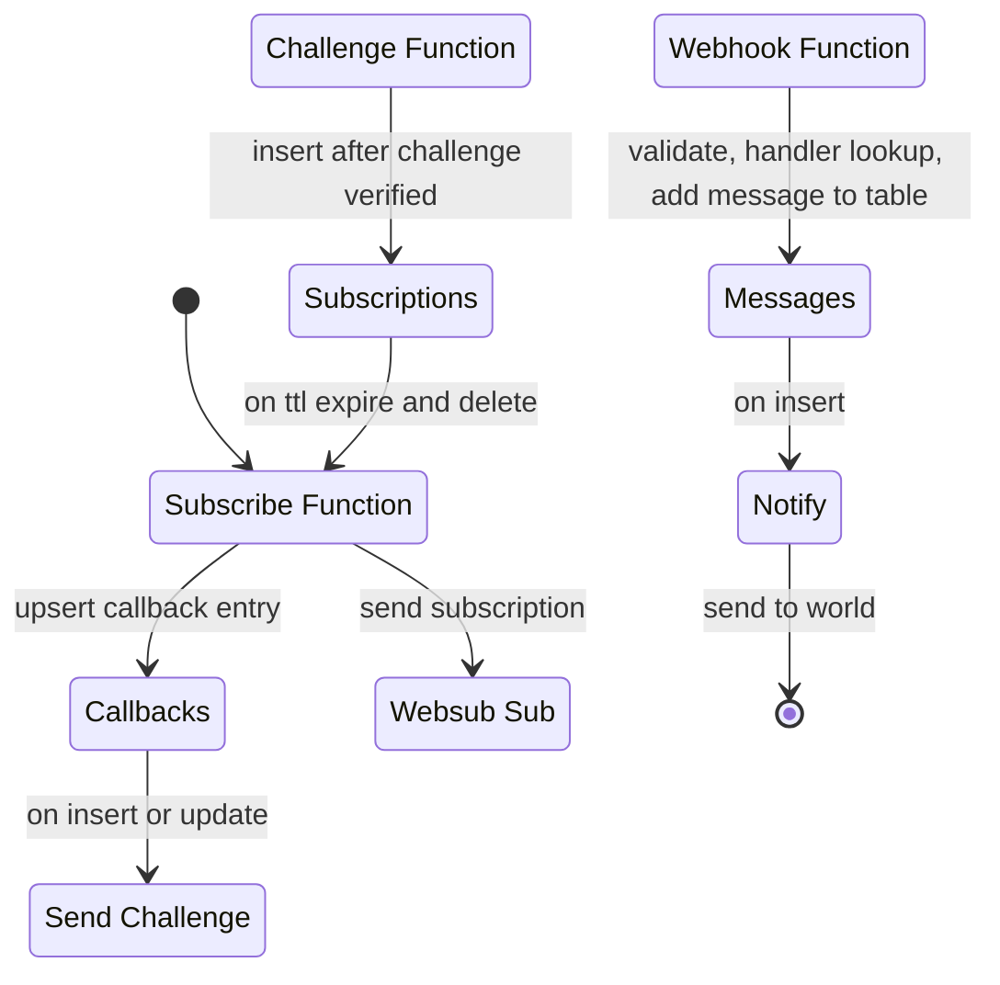

# Websub

collection of lambda functions to eventually potentially act as a websub hub

## Plan


## Schema

### table: subscriptions
    hubUrl: String,
    topicUrl: String,
    handler: String,
    callbackIndex: uuid,
    ttl: ???

### table: callbacks
    index: uuid
    handler: string
    ttl: ???

### table: messages
    index: string
    body: string
    handler: string
    ttl: ???




## Functions

### subscribe
iam: dynamodb:
    subscriptions
    callbacks

```json
{
    "hubUrl": "",
    "topicUrl": "",
    "leaseSeconds": "",
    "handler": "",
    "callbackKey": "optional"
}
```

create callback row
register subscription with ttl


iam: dynamodb

invoke this with event

### subscribe-confirm:
api gateway -> confirm

### renew

iam: dynamodb:
    subscriptions

event source
dynamodb update -> renew -> subscribe


### callback

iam: dynamodb:
    callbacks

api gateway -> callback -> notify


look up callback key from dynamodb, extract event, return notify events


### notify

services: dynamodb? ssm

invoke with event

look up notify secrets for target, send event